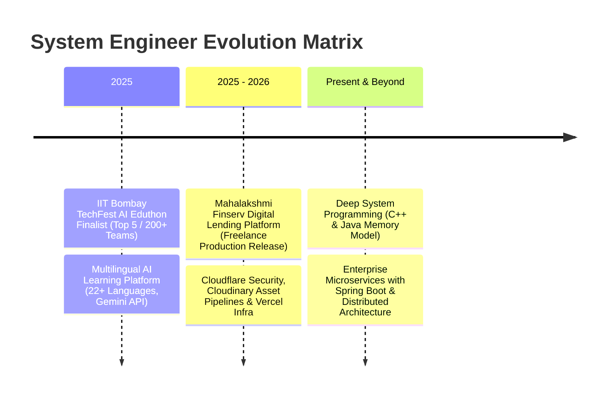

<div align="center">

  <!-- Cyberpunk Neon Header Banner -->
  

  <!-- Terminal Typing Effect -->
  <a href="https://git.io/typing-svg">
    
  </a>

  <br/><br/>

  <!-- Neon Badges & Telemetry -->
  <p align="center">
    
    
    
  </p>

  <p align="center">
    
    <a href="https://github.com/prathmeshbole5-hub?tab=repositories"></a>
    <a href="https://github.com/prathmeshbole5-hub?tab=followers"></a>
  </p>

</div>

---

### 🖥️ `cat /etc/developer.sys`

```cpp
#include <iostream>
#include <vector>

class SystemProgrammer {
private:
    std::string name       = "Prathmesh Bole";
    std::string education  = "B.Tech Computer Engineering (CGPA: 7.8/10)";
    std::string location   = "Sambhajinagar, Maharashtra, India 🇮🇳";
    std::string status     = "Future System & High-Performance Backend Engineer";

public:
    std::vector<std::string> core_stack = {
        "Java", "C++", "C", "Spring Boot", "Generative AI", "MERN Stack"
    };

    void printMission() {
        std::cout << "[+] Mission: Architecting low-level efficiency & high-scale distributed backend systems.\n";
        std::cout << "[+] Current Focus: Advanced DSA in Java/C++, Kernel-level concepts & Microservices.\n";
    }
};

int main() {
    SystemProgrammer dev;
    dev.printMission();
    return 0;
}
```

---

### 📟 Terminal System Log

```bash
[SYSTEM DIAGNOSTIC LOG]
---------------------------------------------------------------------------------------------
[OK] 08:00:01 - Core system initialized on host prathmeshbole5-hub.
[OK] 08:00:02 - Mounted AI Engine: Google Gemini API & LLM integration modules.
[OK] 08:00:03 - Achievement Unlocked: IIT Bombay TechFest 2025 AI Eduthon Finalist (Top 5 / 200+ Teams).
[OK] 08:00:04 - Deployed Production Freelance Platform: Mahalakshmi Finserv (Cloudflare + Vercel).
[OK] 08:00:05 - Microservices & Memory Management status: ACTIVE (Spring Boot & C++ Native).
---------------------------------------------------------------------------------------------
```

---

### 🌐 `ssh prathmesh@connect`

<p align="center">
  <a href="mailto:prathmeshbole10@gmail.com" target="_blank">
    
  </a>
  &nbsp;
  <a href="https://linkedin.com/in/" target="_blank">
    
  </a>
  &nbsp;
  <a href="https://github.com/prathmeshbole5-hub" target="_blank">
    
  </a>
  &nbsp;
  <a href="https://leetcode.com/" target="_blank">
    
  </a>
</p>

---

### ⚡ Skills & Cybernetics Matrix

#### ⚙️ **Systems & Core Languages**
<p align="left">
  <a href="https://skillicons.dev">
    
  </a>
</p>

#### 🛡️ **Backend, Databases & AI Modules**
<p align="left">
  <a href="https://skillicons.dev">
    
  </a>
</p>

#### 🔧 **DevOps, Terminal & Cloud Tools**
<p align="left">
  <a href="https://skillicons.dev">
    
  </a>
</p>

---

### ⏳ System Execution Timeline



---

### 📁 `/sys/projects/` (Deployed Modules)

<table width="100%">
  <tr>
    <td width="50%" valign="top">
      <h3 align="center">🤖 AI Multilingual Education Engine</h3>
      <p align="center"><code>STATUS: DEPLOYED (IIT Bombay TechFest Finalist)</code></p>
      <ul>
        <li><b>Core:</b> Integrated Google Gemini API for real-time interactive AI assistance.</li>
        <li><b>Features:</b> Supported 22+ Indian languages, voice interactive learning & automated quiz generation.</li>
        <li><b>Tech:</b> React.js, Node.js, Express.js, MongoDB, Gemini API, Vercel</li>
      </ul>
    </td>
    <td width="50%" valign="top">
      <h3 align="center">💳 Mahalakshmi Finserv Engine</h3>
      <p align="center"><code>STATUS: PRODUCTION FREELANCE PLATFORM</code></p>
      <ul>
        <li><b>Core:</b> Production lending ecosystem featuring onboarding, loan comparisons & EMI calculator.</li>
        <li><b>Features:</b> Document workflow via Cloudinary API and Cloudflare security rules.</li>
        <li><b>Tech:</b> React.js, Node.js, Express.js, MongoDB, REST APIs, Vercel</li>
      </ul>
    </td>
  </tr>
  <tr>
    <td width="50%" valign="top">
      <h3 align="center">🎓 Alumni Connect Core</h3>
      <p align="center"><code>STATUS: COMPLETED</code></p>
      <ul>
        <li><b>Core:</b> University networking hub connecting alumni and students for mentorship.</li>
        <li><b>Features:</b> Responsive dashboard, authentication & optimized MongoDB query latency.</li>
        <li><b>Tech:</b> React.js, Node.js, Express.js, MongoDB, Git</li>
      </ul>
    </td>
    <td width="50%" valign="top">
      <h3 align="center">🎯 System R&D Objectives</h3>
      <p align="center"><code>STATUS: IN EXECUTION</code></p>
      <ul>
        <li>⚡ <b>Java & C++ DSA:</b> High-efficiency algorithms & data structures.</li>
        <li>🛡️ <b>Spring Boot Microservices:</b> Event-driven systems & REST APIs.</li>
        <li>🧠 <b>Generative AI:</b> Agentic workflows & customized LLM pipelines.</li>
        <li>💻 <b>Low-Level Concepts:</b> Operating System kernel routines & memory layout.</li>
      </ul>
    </td>
  </tr>
</table>

---

### 🎖️ Certifications & Honors

- 🏆 **IIT Bombay TechFest 2025 AI Eduthon Finalist** — Secured **Top 5** spot among **200+ teams** nationwide.
- 🚀 **Full-Stack Freelance Engineer** — Successfully engineered and shipped client production systems.

---

### 📊 System Telemetry & GitHub Analytics

<div align="center">
  <br/>
  
  
  <br/><br/>
  
  <br/><br/>
  
</div>

---

<div align="center">
  
  
  <code>// 01010011 01011001 01010011 01010100 01000101 01001101 01010011 -- CODE THE IMPOSSIBLE.</code>
</div>
